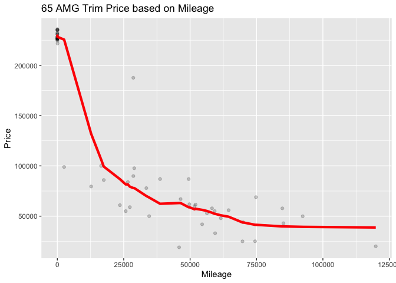

Problem 1: Gas Prices
---------------------

### A) Hypothesis: Gas stations charge more if they lack direct competition in sight

The graph above suggests that gas prices do tend to be higher if there
is no direct competition in sight. The average price of gas at a gas
station without competition in sight is $0.03 higher than when
competition is not present.

### B) Hypothesis: The richer the area, the higher the gas price

The graph above suggests that areas with higher mean incomes also have
higher gas prices on average, though there is a large amount of
variation. Generally, these variables seem to be positively correlated,
however there are a few outliers.

### C) Hypothesis: Shell charges more than other brands

As shown above, there is no significant evidence that Shell charges more
for gas than all other brands. The data suggests that Shell and
Chevron-Texaco gas is comparably priced, while Exxon-Mobil and all other
gas brands tend to be lower.

### D) Hypothesis: Gas stations at stoplights charge more

The graph above shows the price of gas, split between gas stations not
in close proximity to a stoplight on the left, and close to a stoplight
on the right. The graph suggests that in general, gas stations close to
stoplights tend to charge more than gas stations further from
stoplights.

### E) Hypothesis: Gas stations with direct highway access charge more

The graph above shows the mean and distribution of gas prices at gas
stations without direct highway access (on the left) and with direct
highway access (on the right). The graph suggests that gas stations
without direct highway access tend to charge less than gas stations with
direct highway access.

Problem 2: Bike Share Network
-----------------------------

### Plot A: a line graph showing average bike rentals (total) versus hour of the day (hr)

### Plot B: a faceted line graph showing average bike rentals versus hour of the day, faceted according to whether it is a working day (workingday).

The graph above shows total bike rentals by the time of day. Bike
rentals see local peaks around 8am, noon and 5pm. This data is
consistent with expectations of bike rentals increasing during morning
commutes, lunch and evening commutes.

The above graph shows the bike rental data split by weekends on the
left, and work days on the right. On the weekend, bike rentals peak
mid-day. On weekdays, bike rentals peak during morning and evening
commutes and increase slightly during lunch.

### Plot C: a faceted bar plot showing average ridership during the 8 AM hour by weather situation code (weathersit), faceted according to whether it is a working day or not.

The graph above shows bike rentals split by weekends (on the left) and
weekdays (on the right), as well as by weather. A weather situation of 1
indicates clear and dry conditions, 2 indicates misty, and 3 indicates
rain. It is clear that rentals on both weekdays and weekends are
significantly higher when the weather is nice. When the weather is
rainy, rentals are close to zero on weekends, but rentals are greater
than zero on rainy weekdays. This is likely due to commuters having less
choice when going to/from work, while on weekends, riders will simply
not go out.

Problem 3: Austin Bergstrom Flight Data
---------------------------------------

The flight data can be viewed with regard to cancellations by
destination, as shown below. The most-often cancelled flights are to
Dallas (both DFW and DAL), and Chicago O’Hare (ORD).

Cancellations at these three airports (DAL, DFW, ORD) can be further
examined by day of the week, as shown below.

For all three destinations, cancellations peak on Tuesdays. It is
interesting that Tuesdays are the most-likely day tfor a flight to be
cancelled for all three of these destinations. To see if this trend is
consistent for all destinations out of ABIA, we can look at all
cancellations by day of the week.

As shown above, for all destinations out of ABIA, Tuesday flights are
the most likely to be canceled. This series of charts yields two major
takeaways: 1) Tuesdays flights are most likely to be canceled, and 2)
Dallas and O’Hare are the most likely destinations to be cancelled.

Problem 4: S-Class Price based on Mileage and Trim
--------------------------------------------------

Using K-nearest neighbors to predict S Class price based on mileage,
given trim level, yields the results below:

### 350 Trim

The K versus RMSE chart is shown below:

The above chart shows that K value versus RMSE. The RMSE mean value
bottoms out somewhere between k=10 and k=15. Using the “1SE” (one
standard error) rule, taking the k-value where the mean RMSE is about
one standard error above the minimum, yields an optimal k-value of 60.

The above graph shows the fitted model predictions for price versus
mileage for the 350 trim level.

### 65 AMG Trim

The above chart shows that K value versus RMSE. The RMSE mean value
bottoms out at k=15. Using the “1SE” (one standard error) rule, taking
the k-value where the mean RMSE is about one standard error above the
minimum, yields an optimal k-value of 50.

The above graph shows the fitted model predictions for price versus
mileage for the 65 AMG trim level.

Looking at the two K-vs-RMSE graphs above for the two trim levels, it is
interesting to see that though both graphs reach their low RMSE at k=15,
using the one standard error rule yields the optimal value of k=60 for
the 350 trim-level and k=50 for the 65 AMG trim level. This is likely
due to the distribution of data point for the two trim levels. The 350
trim level has a good distribution of data, so is able to be represented
through a prediction based on a large k-value. There are more data
points with a more uniform distribution, so can be captured with a
larger k-value. However, the 65 AMG trim data has fewer data points, as
well as clustering at the 0 mileage point. Therefore, the 65 AMG model
needs to be more sensitive to the data, so using a smaller k-value will
capture this.
