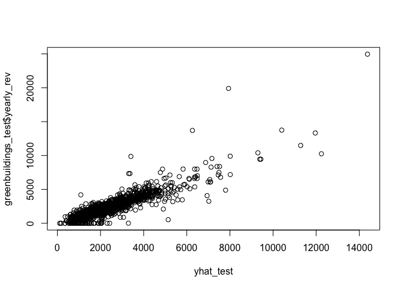
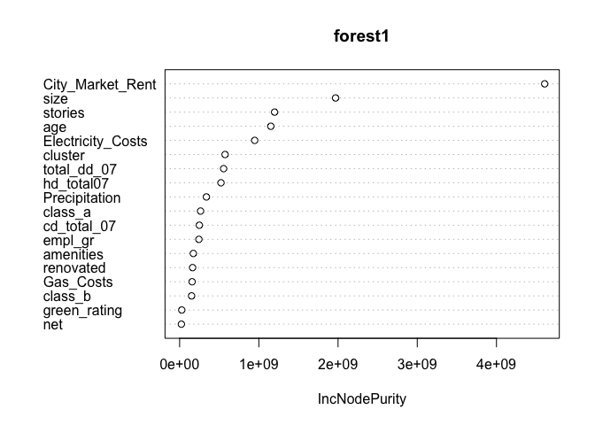
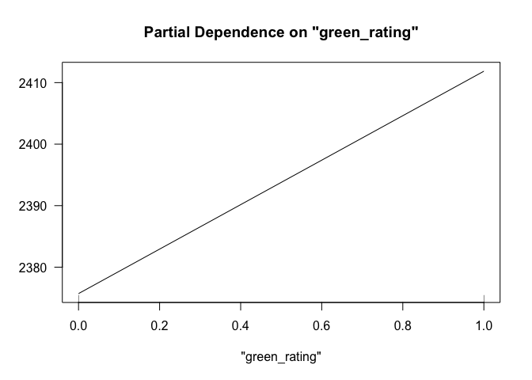
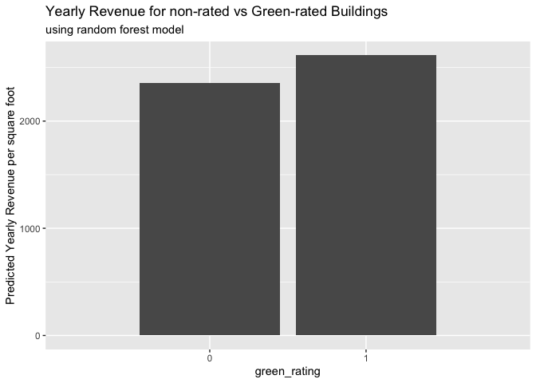
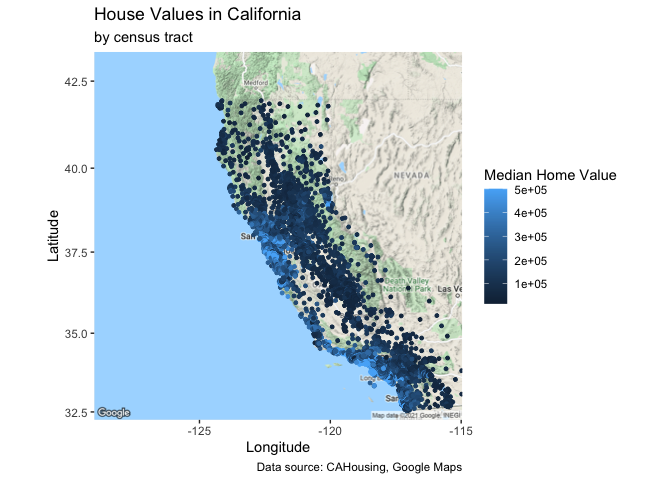
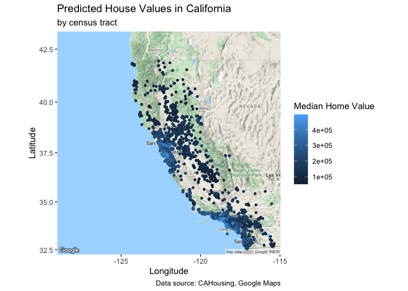
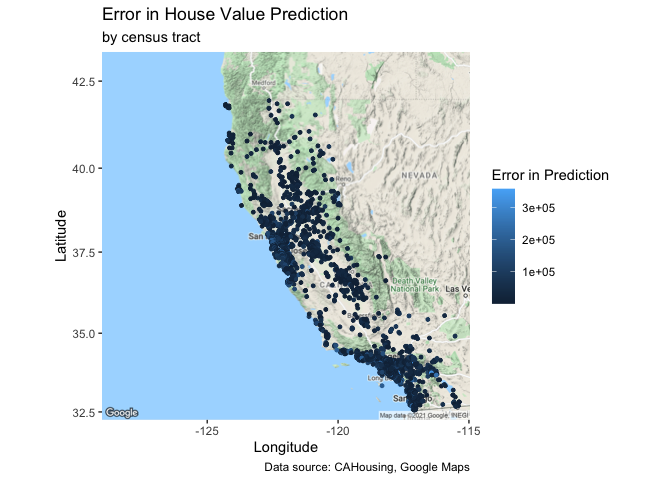

What Causes What?
-----------------

1.  Simply running a regression of “Crime” on “Police” doesn’t capture a
    definitively causal relationship. The regression may lead you to
    asses a causal relationship where there simply may be a correlation.
    High crime cities have an incentive to hire a lot of police, so you
    may see a positive relationship between crime and police due to this
    correlation.

2.  Researchers at UPenn isolated this effect by looking at situations
    where there is a high police presence unrelated to crime. So, the
    researchers look at data when DC is experiencing an orange (medium)
    terrorism alert, so there is an increased police presence in the
    district, unrelated to street crime. This study finds that increased
    police presence causes less street crime (murder, robbery, assault).
    As shown in table 2 column (1), on high alert days, meaning days
    with increased police presence, crime is negatively correlated (an
    estimated 7 fewer crimes on high alert days). When the authors
    control for METRO ridership to account for any change in public
    behaviors due to the high alert, they still find a statistically
    significant reduction in crime of about 6 fewer crimes on high alert
    days.

3.  The researchers controlled for METRO ridership in case there were
    fewer people on the streets on high alert days, thus reducign the
    opportunity and instance of crime. They had to control for this in
    case the reduction in crime was due to fewer crim opportunities and
    not police presence.

4.  This model is estimating crime in DC based on police presence (via
    High Alert days) in district 1 versus other districts, controlling
    for METRO ridership. This regression suggests that the impact of
    police presence in district 1 is associated with lower crime than
    police presence in other districts. The interaction terms show that
    high alert in district 1 reduces crime by ~2.6 crimes while in other
    districts, high alert only reduces crime by ~0.5 crime. This
    regression is also controlled for METRO ridership as discussed
    before.

Predictive Model Building: Green Certification
----------------------------------------------

Commercial real estate owners are looking to understand the value of a
LEED or Energystar building certification in order to decide whether or
not to invest in the certification. Using a dataset that captures a
variety of characteristics of commercial rental properties across the
United States, I aim to predict the value of green building
certification to yearly rental revenue per square foot.

The dataset contains 7820 observations of 23 variables describing
commercial rental properties across the US. These variables include
size, age, renovation status, rent, leasing rate, green certification
and various other qualities. In order to examine the impact of green
certification on yearly revenue per square foot, I use a random forest
model. This model is appropriate due to the the number of variables and
possible interactions, as well as possible non-linearities. The model
will pull in information from variables that are impactful.

In order to run the random forest, I fit the model using all variables
in the dataset to predict the yearly revenue per square foot, where
yearly-revenue-per-sq-ft = Rent \* rental-rate (omitting the Rent,
rental-rate and property ID). Fitting this model resulted in the plot
below of predicted values (x) versus true yearly revenue values (y). The
RMSE on the out-of-sample test set is shown below.

    ## [1] 722.3013

Looking at the variable importance plot below reveals that the most
impactful variables in predicting yearly revenue are the city’s market
rent, the size of the property, number of stories, age, electricity
costs, and location-dependent variables such as heating days, cooling
days and precipitation. It is clear from the plot below that green
certification is not a strong predictor of yearly revenue.

The plot and data below shows the average difference in yearly
revenue-per-square-foot for a green certified (either LEED or
Energystar, or both) building, versus non-green certified. The partial
importance plot below shows the return to yearly revenue for any green
rating, holding all else constant. Achieving any sort of green rating
returns about 80 dollars /sq.ft. per year, holding all other variables
constant. The bar chart and table show that on average, the model
predicts that a non-green building will bring in about 400 dollars/
sq.ft. per year less. The 400 dollar difference in the bar chart is
likely the result of all other factors correlated with green rating, and
not green rating alone. The partial dependence chart shows the true
isolated impact of green rating as $80/sq.ft. per year.

    ## # A tibble: 2 x 2
    ##   green_rating yhat_mean
    ##          <int>     <dbl>
    ## 1            0     2356.
    ## 2            1     2613.

Based on this result, the property owner should weigh the cost of
renovation for green certification per square foot versus the predicted
return and make their decision on green certification accordingly.

Predictive model building: California housing
---------------------------------------------

Using data on homes in California, my goal is to fit a model predict
house value. The data I am using detail the house location, age, rooms,
bedrooms, population of the area, number of homes, as well as median
income. I used a random forest model to predict house value based on
these variables. The random forest model allows for flexibility and
interactions. The model resulted in an out-of-sample error of about
$50k.

    ## [1] 52077.2

The map below shows the census tracts sampled in the dataset, with the
actual median home value of the tract variation shown by color
variation. This clearly shows that homes located on the coast, and
around San Francisco and Los Angeles have the highest value.

The next map below shows the predicted home values using the prediction
model built. This map shows the results using the test data. The model
effectively predicts the higher home values around San Francisco and Los
Angeles on the coast.

The map below show the error on each of the predictions in the test data
shown above. This map shows small error across the entire state, except
for the higher error in the high-value locations of San Francisco and
Los Angeles. This is a reasonable result as properties in these very
high-cost, fast-moving locales tends to be less predictable than more
conventional markets.

