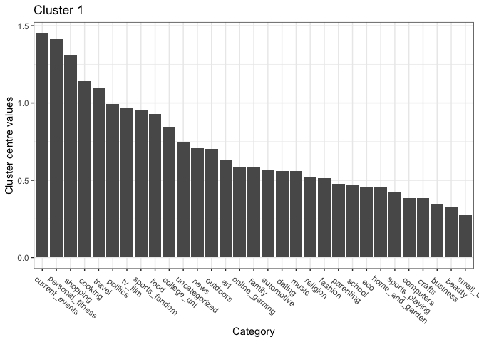

Clustering and PCA: Wine Color and Quality
------------------------------------------

The wine dataset details wine color, quality, and 11 chemical
attributes. Using these variables, I performed principle component
analysis, compressing all the variables down into 5 principle
components. Once I examined these components, I found that only 1
component (PC1) was very powerful in its correlation with color, and no
principle component consistently is correlated with quality, so I
reduced the PCA to just 2 components. Below is a plot of the two
principle components, with the color of each data point denoting the
color of the wine in the first graph (red = 1, white = 0), and color
denoting wine quality in the second.

    ## Importance of first k=2 (out of 11) components:
    ##                           PC1    PC2
    ## Standard deviation     1.7407 1.5792
    ## Proportion of Variance 0.2754 0.2267
    ## Cumulative Proportion  0.2754 0.5021

Clearly, component 1 is highly correlated with the wine color. Neither
component is correlated with quality. I then combine the PC1 and PC2
variables with the dataset for each wine, and build a random forest
model of wine color regressed on these components on a training set. The
resulting RMSE from testing the model on a test set against actual wine
color is below (~0.1). Additionally, the variable importance plot below
confirms that PC1 is most significant in predicting wine color.

    ## [1] 0.1017112

I then tested out the predictive power of this random forest model for
predicting wine quality. The RMSE and variable importance plot is below.
PC2 is most important in predicting wine quality, but PC1 is also
significant.

    ## [1] 0.7195767

### Clustering for Wine Color and Quality

I also ran k-means clustering to predict wine color by removing the
color and quality variables, and splitting the data into 2 clusters
based on the other 11 chemical elements. To see how effectively the
clusters captured color, I attached the cluster assignment to the data
and observed that cluster 1 captures mostly red wines, and cluster 2
captures mostly white wines. I then looked at the RMSE to see how well
the clusters align with the actual wine color. The kmeans-method
captured wine color effectively with an RMSE of ~0.11.

    ## [1] 0.9928946

### Conclusion

I recommend using the PCA method of predicting wine color. Kmeans
clustering also does a decnt job of predicting wine color, just is not
quite as effective as PCA. I found that there is no reliable way to
predict the wine quality score, which is understandable as quality is
objective and dictated by a diverse group of people and palates.

Market Segmentation: Twitter Marketing
--------------------------------------

HOW CHOOSE \# OF CLUSTERS

In order to streamline and sharpen the marketing efforts of NutrientH2O,
we have assembled a dataset of tweet categorizations for the brand’s
followers. After analyzing this data, we have a few insights that may
lead to more focused, productive marketing.

    ## [1] 5184  495  635  816  752

After some experimentation, I used kmeans++ to sort the tweet data into
clusters. After experimenting with various numbers of clusters, I chose
to separate the data into 5 clusters. These clusters are different
sizes, but capture very specific interest groups. One cluster is by far
the largest, and the other 4 are smaller in comparison, but capture more
specific interests. The five clusters can be summarized by their key
topics below.

#### Cluster topics:

##### Cluster A, “say it with a tweet”: Current Events, Personal Fitness, Shopping

##### Cluster B, “college kids”: College, Online Gaming

##### Cluster C, “pinterest crowd”: Cooking, Fashion, Beauty

##### Cluster D, “southern parents”: Sports, religion, food, parenting

##### Cluster E, “business crowd”: politics, travel, news

I have created a nickname for each cluster based on the topics. The
largest cluster, Cluster A (5207 users), is most likely the cluster of
people who tweet about anything and everything. This cluster may be
difficult to hone in on as it is more difficult to target specifically.
However, the other 4 clusters are very specific and easily targetable.

The “college kids” (455 users) cluster tweets about gaming and their
colleges, as well as about sports. Targeting this crowd with
University-specific campaigns may be effective.

The “pinterest crowd” cluster (639 users) tweets often about cooking,
fashion and beauty. These three topics usually draw in a crowd that
would be a heavy user of the platform Pinterest which enables users to
easily find recipes, clothes, and cooking techniques, among other
things. This segment could be targeted through partnering with specific
brands or going the “influencer” route and paying for instagram
influencers to promote product.

The “southern parents” (830 users) cluster tweets often about sports,
religion, food and parenting. This cluster can be targeted through ads
during sporting events or by appealing to the benefits of the product
for children or for energy needed when raising children.

The final cluster is the “business crowd” (751 users) who tweet about
politics, travel and news. This segment can be targeted through
newspapers, travel lounges, or other news outlets.

Each cluster can be grown by using a targeted, thoughtful approach to
marketing.

Association Rules for Grocery Purchases
---------------------------------------

Using data from ~9800 grocery baskets, I have created a set of rules
that reflect buying behavior. After playing with the support and
confidence levels, I chose to create rules based on a support level of
&gt; 0.0025, confidence of over 0.5, and with a maximum cart size of 8
items. This specification created 645 ‘rules’. After a lot of playing
around with the confidence and support levels, I chose these levels to
see a variety of relatively likely combinations, to then trim down into
more likely rules. The support level indicates the proportion of times
any combination of items occurred in the dataset. A support level of at
least 0.0025 means that at the bare minimum, any rule must have occurred
in the cart 25 times. The confidence level captures the probability the
right hand side groceries are in the cart, given the left hand side
groceries are in the cart. I felt a 50% confidence was a sufficient
floor to work from. Finally, I made the minimum length 1 item in order
to capture in highly likely, single item purchases.

After creating this set of rules, I trimmed the rules down to only
include rules with confidence over 50%. Below is the plot of the full
set of 171 rules. The lift range on the graph details the increase in
probability that the right hand side occurs, given the left hand side
occurs.

    ## Apriori
    ## 
    ## Parameter specification:
    ##  confidence minval smax arem  aval originalSupport maxtime support minlen
    ##        0.25    0.1    1 none FALSE            TRUE       5  0.0025      1
    ##  maxlen target  ext
    ##      10  rules TRUE
    ## 
    ## Algorithmic control:
    ##  filter tree heap memopt load sort verbose
    ##     0.1 TRUE TRUE  FALSE TRUE    2    TRUE
    ## 
    ## Absolute minimum support count: 24 
    ## 
    ## set item appearances ...[0 item(s)] done [0.00s].
    ## set transactions ...[169 item(s), 9835 transaction(s)] done [0.00s].
    ## sorting and recoding items ... [142 item(s)] done [0.00s].
    ## creating transaction tree ... done [0.00s].
    ## checking subsets of size 1 2 3 4 5 done [0.01s].
    ## writing ... [2570 rule(s)] done [0.00s].
    ## creating S4 object  ... done [0.01s].

    ## To reduce overplotting, jitter is added! Use jitter = 0 to prevent jitter.

Using the trimmed subset with confidence &gt; 0.6 and support &gt; 0.005
yields the 22 rules below. Notice that the lift for these rules ranges
from ~2-3. These rules reflect the frequency with which customers
purchase whole milk and vegetables. It seems that these two items are
the only ones that can be predicted with high confidence and support,
likely due the frequency with which they are purchased.

    ##      lhs                        rhs                    support confidence    coverage     lift count
    ## [1]  {onions,                                                                                       
    ##       root vegetables}       => {other vegetables} 0.005693950  0.6021505 0.009456024 3.112008    56
    ## [2]  {curd,                                                                                         
    ##       tropical fruit}        => {whole milk}       0.006507372  0.6336634 0.010269446 2.479936    64
    ## [3]  {domestic eggs,                                                                                
    ##       margarine}             => {whole milk}       0.005185562  0.6219512 0.008337570 2.434099    51
    ## [4]  {butter,                                                                                       
    ##       domestic eggs}         => {whole milk}       0.005998983  0.6210526 0.009659380 2.430582    59
    ## [5]  {butter,                                                                                       
    ##       whipped/sour cream}    => {whole milk}       0.006710727  0.6600000 0.010167768 2.583008    66
    ## [6]  {bottled water,                                                                                
    ##       butter}                => {whole milk}       0.005388917  0.6022727 0.008947636 2.357084    53
    ## [7]  {butter,                                                                                       
    ##       tropical fruit}        => {whole milk}       0.006202339  0.6224490 0.009964413 2.436047    61
    ## [8]  {butter,                                                                                       
    ##       root vegetables}       => {whole milk}       0.008235892  0.6377953 0.012913066 2.496107    81
    ## [9]  {butter,                                                                                       
    ##       yogurt}                => {whole milk}       0.009354347  0.6388889 0.014641586 2.500387    92
    ## [10] {domestic eggs,                                                                                
    ##       pip fruit}             => {whole milk}       0.005388917  0.6235294 0.008642603 2.440275    53
    ## [11] {domestic eggs,                                                                                
    ##       tropical fruit}        => {whole milk}       0.006914082  0.6071429 0.011387900 2.376144    68
    ## [12] {pip fruit,                                                                                    
    ##       whipped/sour cream}    => {other vegetables} 0.005592272  0.6043956 0.009252669 3.123610    55
    ## [13] {pip fruit,                                                                                    
    ##       whipped/sour cream}    => {whole milk}       0.005998983  0.6483516 0.009252669 2.537421    59
    ## [14] {fruit/vegetable juice,                                                                        
    ##       other vegetables,                                                                             
    ##       yogurt}                => {whole milk}       0.005083884  0.6172840 0.008235892 2.415833    50
    ## [15] {other vegetables,                                                                             
    ##       root vegetables,                                                                              
    ##       whipped/sour cream}    => {whole milk}       0.005185562  0.6071429 0.008540925 2.376144    51
    ## [16] {other vegetables,                                                                             
    ##       pip fruit,                                                                                    
    ##       root vegetables}       => {whole milk}       0.005490595  0.6750000 0.008134215 2.641713    54
    ## [17] {pip fruit,                                                                                    
    ##       root vegetables,                                                                              
    ##       whole milk}            => {other vegetables} 0.005490595  0.6136364 0.008947636 3.171368    54
    ## [18] {other vegetables,                                                                             
    ##       pip fruit,                                                                                    
    ##       yogurt}                => {whole milk}       0.005083884  0.6250000 0.008134215 2.446031    50
    ## [19] {citrus fruit,                                                                                 
    ##       root vegetables,                                                                              
    ##       whole milk}            => {other vegetables} 0.005795628  0.6333333 0.009150991 3.273165    57
    ## [20] {root vegetables,                                                                              
    ##       tropical fruit,                                                                               
    ##       yogurt}                => {whole milk}       0.005693950  0.7000000 0.008134215 2.739554    56
    ## [21] {other vegetables,                                                                             
    ##       tropical fruit,                                                                               
    ##       yogurt}                => {whole milk}       0.007625826  0.6198347 0.012302999 2.425816    75
    ## [22] {other vegetables,                                                                             
    ##       root vegetables,                                                                              
    ##       yogurt}                => {whole milk}       0.007829181  0.6062992 0.012913066 2.372842    77

If we loosen the rules and only require that the lift be greater than
15, we find these rules below. Sorting rules based on lift instead of
confidence demonstrates clusters of items that are frequently bought
together, even if they do not occur enough to result in high confidence
or support. The clusters below can be loosely interpreted as an alcohol
cluster, a snack cluster, a baking cluster, a sandwich cluster, and
other non-specific clusters.

    ## Apriori
    ## 
    ## Parameter specification:
    ##  confidence minval smax arem  aval originalSupport maxtime support minlen
    ##         0.1    0.1    1 none FALSE            TRUE       5   0.001      1
    ##  maxlen target  ext
    ##       8  rules TRUE
    ## 
    ## Algorithmic control:
    ##  filter tree heap memopt load sort verbose
    ##     0.1 TRUE TRUE  FALSE TRUE    2    TRUE
    ## 
    ## Absolute minimum support count: 9 
    ## 
    ## set item appearances ...[0 item(s)] done [0.00s].
    ## set transactions ...[169 item(s), 9835 transaction(s)] done [0.00s].
    ## sorting and recoding items ... [157 item(s)] done [0.00s].
    ## creating transaction tree ... done [0.00s].
    ## checking subsets of size 1 2 3 4 5 6 done [0.01s].
    ## writing ... [32791 rule(s)] done [0.01s].
    ## creating S4 object  ... done [0.01s].

    ##      lhs                        rhs                         support confidence    coverage     lift count
    ## [1]  {bottled beer,                                                                                      
    ##       liquor}                => {red/blush wine}        0.001931876  0.4130435 0.004677173 21.49356    19
    ## [2]  {bottled beer,                                                                                      
    ##       red/blush wine}        => {liquor}                0.001931876  0.3958333 0.004880529 35.71579    19
    ## [3]  {popcorn,                                                                                           
    ##       soda}                  => {salty snack}           0.001220132  0.6315789 0.001931876 16.69779    12
    ## [4]  {salty snack,                                                                                       
    ##       soda}                  => {popcorn}               0.001220132  0.1304348 0.009354347 18.06797    12
    ## [5]  {Instant food products,                                                                             
    ##       soda}                  => {hamburger meat}        0.001220132  0.6315789 0.001931876 18.99565    12
    ## [6]  {hamburger meat,                                                                                    
    ##       soda}                  => {Instant food products} 0.001220132  0.2105263 0.005795628 26.20919    12
    ## [7]  {Instant food products,                                                                             
    ##       whole milk}            => {hamburger meat}        0.001525165  0.5000000 0.003050330 15.03823    15
    ## [8]  {ham,                                                                                               
    ##       processed cheese}      => {white bread}           0.001931876  0.6333333 0.003050330 15.04549    19
    ## [9]  {processed cheese,                                                                                  
    ##       white bread}           => {ham}                   0.001931876  0.4634146 0.004168785 17.80345    19
    ## [10] {ham,                                                                                               
    ##       white bread}           => {processed cheese}      0.001931876  0.3800000 0.005083884 22.92822    19
    ## [11] {fruit/vegetable juice,                                                                             
    ##       ham}                   => {processed cheese}      0.001118454  0.2894737 0.003863752 17.46610    11
    ## [12] {baking powder,                                                                                     
    ##       flour}                 => {sugar}                 0.001016777  0.5555556 0.001830198 16.40807    10
    ## [13] {baking powder,                                                                                     
    ##       sugar}                 => {flour}                 0.001016777  0.3125000 0.003253686 17.97332    10
    ## [14] {sugar,                                                                                             
    ##       whipped/sour cream}    => {baking powder}         0.001321810  0.2708333 0.004880529 15.30831    13
    ## [15] {curd,                                                                                              
    ##       sugar}                 => {flour}                 0.001118454  0.3235294 0.003457041 18.60767    11
    ## [16] {margarine,                                                                                         
    ##       sugar}                 => {flour}                 0.001626843  0.2962963 0.005490595 17.04137    16
    ## [17] {butter,                                                                                            
    ##       root vegetables,                                                                                   
    ##       whole milk}            => {rice}                  0.001016777  0.1234568 0.008235892 16.18930    10
    ## [18] {soda,                                                                                              
    ##       white bread,                                                                                       
    ##       whole milk}            => {processed cheese}      0.001016777  0.2500000 0.004067107 15.08436    10
    ## [19] {root vegetables,                                                                                   
    ##       sugar,                                                                                             
    ##       whole milk}            => {flour}                 0.001016777  0.2941176 0.003457041 16.91606    10
    ## [20] {other vegetables,                                                                                  
    ##       root vegetables,                                                                                   
    ##       whole milk,                                                                                        
    ##       yogurt}                => {rice}                  0.001321810  0.1688312 0.007829181 22.13939    13

Author Attribution
------------------

Fo rthis problem, I used text from 50 authors with 50 articles each to
predict authorship based on words used. In order to do this, I first
read and cleaned all of the file names from the directory source. I then
read in the text from every article and stored in in a large corpus. In
order to standardize the text, I removed punctuation, capitalization and
whitespace, as well as common words using the “SMART” dictionary.

Once all of the training and testing data was processed, I created a
Document Term Matrix (DTM) for both the testing and training sets.

    ## <<DocumentTermMatrix (documents: 2500, terms: 848)>>
    ## Non-/sparse entries: 204235/1915765
    ## Sparsity           : 90%
    ## Maximal term length: 18
    ## Weighting          : term frequency (tf)

The training DTM details are above. I have trimmed the words that are
only included a few times in order to eliminate noise. We are left with
~850 words, down from ~31,000. I repeat the same process of creating the
DTM for the test set of data, except instead of trimming sparse words, I
go ahead and set the limitation that all words in the test DTM must also
be in the training DTM.

    ## <<DocumentTermMatrix (documents: 2500, terms: 848)>>
    ## Non-/sparse entries: 204756/1915244
    ## Sparsity           : 90%
    ## Maximal term length: 18
    ## Weighting          : term frequency (tf)

Above are the details for the testing set which matches the training
set.

Next, I remove any columns in the testing or training sets that contain
no values (no words in articles), and I confirm that all columns match
between testing and training.

### PCA

In order to try prediction models, I first use PCA to create principle
components to use as variables in prediction. I create principle
components using the training data, and then predict the PCA values onto
the testing data. I then look at the cumulative variance explained
versus the number of principle components in order to choose a number of
principle components that explains about 75% of the variance. This
occurs at PC263, so I will move forward using the first 263 principle
components. The chart below shows the sumulative sum of the variance
versus the number of principle components.

    ##        PC1        PC2        PC3        PC4        PC5        PC6        PC7 
    ## 0.01926955 0.03263776 0.04318702 0.05331802 0.06298473 0.07169836 0.07997528 
    ##        PC8        PC9       PC10       PC11       PC12       PC13       PC14 
    ## 0.08739272 0.09457369 0.10164650 0.10816787 0.11409123 0.11960025 0.12484723 
    ##       PC15       PC16       PC17       PC18       PC19       PC20       PC21 
    ## 0.12998162 0.13502067 0.13998620 0.14490171 0.14966593 0.15430261 0.15882198 
    ##       PC22       PC23       PC24       PC25       PC26       PC27       PC28 
    ## 0.16324335 0.16759483 0.17184891 0.17598458 0.18007224 0.18401093 0.18791569 
    ##       PC29       PC30       PC31       PC32       PC33       PC34       PC35 
    ## 0.19169998 0.19547487 0.19922118 0.20287664 0.20649453 0.21010414 0.21360259 
    ##       PC36       PC37       PC38       PC39       PC40       PC41       PC42 
    ## 0.21707700 0.22053013 0.22393616 0.22731366 0.23064392 0.23391940 0.23716141 
    ##       PC43       PC44       PC45       PC46       PC47       PC48       PC49 
    ## 0.24038521 0.24356826 0.24670808 0.24983293 0.25293102 0.25600977 0.25907986 
    ##       PC50       PC51       PC52       PC53       PC54       PC55       PC56 
    ## 0.26212273 0.26510121 0.26806509 0.27101572 0.27394163 0.27685935 0.27976709 
    ##       PC57       PC58       PC59       PC60       PC61       PC62       PC63 
    ## 0.28264228 0.28549139 0.28831795 0.29112943 0.29391189 0.29668473 0.29943897 
    ##       PC64       PC65       PC66       PC67       PC68       PC69       PC70 
    ## 0.30217813 0.30490222 0.30762306 0.31030909 0.31299085 0.31564729 0.31828122 
    ##       PC71       PC72       PC73       PC74       PC75       PC76       PC77 
    ## 0.32089594 0.32350570 0.32610517 0.32868380 0.33124921 0.33380314 0.33634450 
    ##       PC78       PC79       PC80       PC81       PC82       PC83       PC84 
    ## 0.33887542 0.34139259 0.34389526 0.34637957 0.34885509 0.35131989 0.35377126 
    ##       PC85       PC86       PC87       PC88       PC89       PC90       PC91 
    ## 0.35620589 0.35863183 0.36105176 0.36345274 0.36584576 0.36822713 0.37059312 
    ##       PC92       PC93       PC94       PC95       PC96       PC97       PC98 
    ## 0.37295301 0.37529853 0.37763772 0.37997119 0.38228425 0.38458145 0.38687583 
    ##       PC99      PC100      PC101      PC102      PC103      PC104      PC105 
    ## 0.38916513 0.39142985 0.39368613 0.39594010 0.39819035 0.40042799 0.40265610 
    ##      PC106      PC107      PC108      PC109      PC110      PC111      PC112 
    ## 0.40487955 0.40709210 0.40930123 0.41150278 0.41369572 0.41587180 0.41803188 
    ##      PC113      PC114      PC115      PC116      PC117      PC118      PC119 
    ## 0.42018977 0.42233816 0.42447963 0.42661618 0.42873533 0.43085186 0.43295867 
    ##      PC120      PC121      PC122      PC123      PC124      PC125      PC126 
    ## 0.43504866 0.43713567 0.43921267 0.44128191 0.44334473 0.44540506 0.44744162 
    ##      PC127      PC128      PC129      PC130      PC131      PC132      PC133 
    ## 0.44947482 0.45149779 0.45351685 0.45552648 0.45752963 0.45952925 0.46152745 
    ##      PC134      PC135      PC136      PC137      PC138      PC139      PC140 
    ## 0.46351176 0.46548063 0.46744628 0.46940593 0.47136036 0.47330184 0.47523718 
    ##      PC141      PC142      PC143      PC144      PC145      PC146      PC147 
    ## 0.47716918 0.47909415 0.48101034 0.48292315 0.48482858 0.48672845 0.48861980 
    ##      PC148      PC149      PC150      PC151      PC152      PC153      PC154 
    ## 0.49050346 0.49238533 0.49425860 0.49611538 0.49796787 0.49981612 0.50165768 
    ##      PC155      PC156      PC157      PC158      PC159      PC160      PC161 
    ## 0.50348989 0.50531919 0.50713645 0.50894380 0.51074893 0.51255184 0.51434671 
    ##      PC162      PC163      PC164      PC165      PC166      PC167      PC168 
    ## 0.51613489 0.51791841 0.51969588 0.52146765 0.52322974 0.52499118 0.52674421 
    ##      PC169      PC170      PC171      PC172      PC173      PC174      PC175 
    ## 0.52849660 0.53023931 0.53197537 0.53370479 0.53542558 0.53714068 0.53885284 
    ##      PC176      PC177      PC178      PC179      PC180      PC181      PC182 
    ## 0.54056024 0.54225621 0.54394605 0.54563013 0.54730825 0.54897985 0.55064325 
    ##      PC183      PC184      PC185      PC186      PC187      PC188      PC189 
    ## 0.55230553 0.55396712 0.55561640 0.55726239 0.55890667 0.56054907 0.56218509 
    ##      PC190      PC191      PC192      PC193      PC194      PC195      PC196 
    ## 0.56381909 0.56544137 0.56706039 0.56867507 0.57028821 0.57189849 0.57350373 
    ##      PC197      PC198      PC199      PC200      PC201      PC202      PC203 
    ## 0.57509954 0.57668844 0.57826735 0.57984448 0.58141877 0.58298763 0.58454746 
    ##      PC204      PC205      PC206      PC207      PC208      PC209      PC210 
    ## 0.58609816 0.58764732 0.58918933 0.59072640 0.59225920 0.59378576 0.59530659 
    ##      PC211      PC212      PC213      PC214      PC215      PC216      PC217 
    ## 0.59682262 0.59833691 0.59984845 0.60135166 0.60285392 0.60435341 0.60584829 
    ##      PC218      PC219      PC220      PC221      PC222      PC223      PC224 
    ## 0.60733800 0.60882060 0.61029557 0.61176646 0.61323446 0.61469921 0.61615652 
    ##      PC225      PC226      PC227      PC228      PC229      PC230      PC231 
    ## 0.61761014 0.61906091 0.62050579 0.62194337 0.62337632 0.62480690 0.62623234 
    ##      PC232      PC233      PC234      PC235      PC236      PC237      PC238 
    ## 0.62764745 0.62906021 0.63046862 0.63187482 0.63327485 0.63466936 0.63606173 
    ##      PC239      PC240      PC241      PC242      PC243      PC244      PC245 
    ## 0.63744859 0.63883190 0.64020854 0.64158136 0.64295256 0.64431837 0.64568094 
    ##      PC246      PC247      PC248      PC249      PC250      PC251      PC252 
    ## 0.64703967 0.64839435 0.64974181 0.65108625 0.65242773 0.65376623 0.65510257 
    ##      PC253      PC254      PC255      PC256      PC257      PC258      PC259 
    ## 0.65643632 0.65776416 0.65908944 0.66041060 0.66172632 0.66303787 0.66434544 
    ##      PC260      PC261      PC262      PC263      PC264      PC265      PC266 
    ## 0.66564759 0.66694861 0.66824427 0.66953407 0.67081714 0.67209645 0.67337063 
    ##      PC267      PC268      PC269      PC270      PC271      PC272      PC273 
    ## 0.67464172 0.67591166 0.67717994 0.67844217 0.67969995 0.68095429 0.68220470 
    ##      PC274      PC275      PC276      PC277      PC278      PC279      PC280 
    ## 0.68345264 0.68469746 0.68594114 0.68718089 0.68841731 0.68964851 0.69087514 
    ##      PC281      PC282      PC283      PC284      PC285      PC286      PC287 
    ## 0.69209650 0.69331677 0.69452804 0.69573611 0.69694190 0.69814354 0.69934268 
    ##      PC288      PC289      PC290      PC291      PC292      PC293      PC294 
    ## 0.70053419 0.70172439 0.70291041 0.70409563 0.70527901 0.70645454 0.70762746 
    ##      PC295      PC296      PC297      PC298      PC299      PC300      PC301 
    ## 0.70879596 0.70995814 0.71111697 0.71227308 0.71342635 0.71457636 0.71572217 
    ##      PC302      PC303      PC304      PC305      PC306      PC307      PC308 
    ## 0.71686444 0.71800606 0.71914617 0.72028451 0.72141648 0.72254759 0.72367315 
    ##      PC309      PC310      PC311      PC312      PC313      PC314      PC315 
    ## 0.72479278 0.72590588 0.72701590 0.72812296 0.72922338 0.73032275 0.73141961 
    ##      PC316      PC317      PC318      PC319      PC320      PC321      PC322 
    ## 0.73251284 0.73360476 0.73469408 0.73577827 0.73685754 0.73793556 0.73901042 
    ##      PC323      PC324      PC325      PC326      PC327      PC328      PC329 
    ## 0.74007829 0.74114368 0.74220586 0.74326647 0.74432384 0.74537990 0.74643176 
    ##      PC330      PC331      PC332      PC333      PC334      PC335      PC336 
    ## 0.74748027 0.74852535 0.74956510 0.75060290 0.75163908 0.75267283 0.75370526 
    ##      PC337      PC338      PC339      PC340      PC341      PC342      PC343 
    ## 0.75473346 0.75575964 0.75678227 0.75779904 0.75881218 0.75982461 0.76083470 
    ##      PC344      PC345      PC346      PC347      PC348      PC349      PC350 
    ## 0.76184142 0.76284542 0.76384627 0.76484575 0.76584035 0.76683453 0.76782528 
    ##      PC351      PC352      PC353      PC354      PC355      PC356      PC357 
    ## 0.76881234 0.76979713 0.77077815 0.77175410 0.77272576 0.77369434 0.77466140 
    ##      PC358      PC359      PC360      PC361      PC362      PC363      PC364 
    ## 0.77562670 0.77658928 0.77754805 0.77850367 0.77945815 0.78041008 0.78135728 
    ##      PC365      PC366      PC367      PC368      PC369      PC370      PC371 
    ## 0.78230422 0.78324655 0.78418465 0.78511999 0.78605226 0.78697997 0.78790516 
    ##      PC372      PC373      PC374      PC375      PC376      PC377      PC378 
    ## 0.78882838 0.78974863 0.79066505 0.79157618 0.79248489 0.79338974 0.79429294 
    ##      PC379      PC380      PC381      PC382      PC383      PC384      PC385 
    ## 0.79519375 0.79609208 0.79698783 0.79788104 0.79877197 0.79966140 0.80054762 
    ##      PC386      PC387      PC388      PC389      PC390      PC391      PC392 
    ## 0.80143026 0.80230802 0.80318408 0.80405531 0.80492216 0.80578723 0.80665083 
    ##      PC393      PC394      PC395      PC396      PC397      PC398      PC399 
    ## 0.80751093 0.80837045 0.80922624 0.81007834 0.81092784 0.81177648 0.81262314 
    ##      PC400      PC401      PC402      PC403      PC404      PC405      PC406 
    ## 0.81346423 0.81430332 0.81514071 0.81597438 0.81680738 0.81763703 0.81846466 
    ##      PC407      PC408      PC409      PC410      PC411      PC412      PC413 
    ## 0.81929052 0.82011230 0.82093074 0.82174710 0.82256074 0.82337297 0.82418256 
    ##      PC414      PC415      PC416      PC417      PC418      PC419      PC420 
    ## 0.82499071 0.82579791 0.82660165 0.82740302 0.82820203 0.82899864 0.82979237 
    ##      PC421      PC422      PC423      PC424      PC425      PC426      PC427 
    ## 0.83058251 0.83137118 0.83215848 0.83294385 0.83372431 0.83450392 0.83527871 
    ##      PC428      PC429      PC430      PC431      PC432      PC433      PC434 
    ## 0.83605265 0.83682406 0.83759312 0.83835921 0.83912315 0.83988312 0.84064066 
    ##      PC435      PC436      PC437      PC438      PC439      PC440      PC441 
    ## 0.84139737 0.84215247 0.84290609 0.84365447 0.84440282 0.84514825 0.84588954 
    ##      PC442      PC443      PC444      PC445      PC446      PC447      PC448 
    ## 0.84663023 0.84736788 0.84810163 0.84883499 0.84956551 0.85029395 0.85102113 
    ##      PC449      PC450      PC451      PC452      PC453      PC454      PC455 
    ## 0.85174554 0.85246559 0.85318136 0.85389568 0.85460906 0.85532055 0.85603115 
    ##      PC456      PC457      PC458      PC459      PC460      PC461      PC462 
    ## 0.85673790 0.85744372 0.85814769 0.85884911 0.85954871 0.86024484 0.86093941 
    ##      PC463      PC464      PC465      PC466      PC467      PC468      PC469 
    ## 0.86163227 0.86232146 0.86300815 0.86369416 0.86437541 0.86505509 0.86573299 
    ##      PC470      PC471      PC472      PC473      PC474      PC475      PC476 
    ## 0.86640809 0.86708258 0.86775519 0.86842574 0.86909284 0.86975758 0.87042063 
    ##      PC477      PC478      PC479      PC480      PC481      PC482      PC483 
    ## 0.87108018 0.87173848 0.87239354 0.87304724 0.87369857 0.87434823 0.87499517 
    ##      PC484      PC485      PC486      PC487      PC488      PC489      PC490 
    ## 0.87564084 0.87628264 0.87692311 0.87756296 0.87819941 0.87883374 0.87946743 
    ##      PC491      PC492      PC493      PC494      PC495      PC496      PC497 
    ## 0.88009886 0.88072808 0.88135518 0.88197989 0.88260207 0.88322353 0.88384334 
    ##      PC498      PC499      PC500      PC501      PC502      PC503      PC504 
    ## 0.88445895 0.88507345 0.88568614 0.88629678 0.88690627 0.88751391 0.88812011 
    ##      PC505      PC506      PC507      PC508      PC509      PC510      PC511 
    ## 0.88872084 0.88932036 0.88991874 0.89051520 0.89111009 0.89170056 0.89228913 
    ##      PC512      PC513      PC514      PC515      PC516      PC517      PC518 
    ## 0.89287625 0.89346178 0.89404487 0.89462515 0.89520460 0.89578158 0.89635594 
    ##      PC519      PC520      PC521      PC522      PC523      PC524      PC525 
    ## 0.89692923 0.89750148 0.89807287 0.89864036 0.89920671 0.89977235 0.90033298 
    ##      PC526      PC527      PC528      PC529      PC530      PC531      PC532 
    ## 0.90089119 0.90144828 0.90200396 0.90255684 0.90310825 0.90365834 0.90420705 
    ##      PC533      PC534      PC535      PC536      PC537      PC538      PC539 
    ## 0.90475399 0.90529906 0.90584168 0.90638345 0.90692242 0.90746061 0.90799791 
    ##      PC540      PC541      PC542      PC543      PC544      PC545      PC546 
    ## 0.90853265 0.90906278 0.90959152 0.91011887 0.91064385 0.91116735 0.91168966 
    ##      PC547      PC548      PC549      PC550      PC551      PC552      PC553 
    ## 0.91221148 0.91272957 0.91324665 0.91376141 0.91427524 0.91478776 0.91529979 
    ##      PC554      PC555      PC556      PC557      PC558      PC559      PC560 
    ## 0.91580824 0.91631574 0.91682115 0.91732529 0.91782787 0.91832786 0.91882627 
    ##      PC561      PC562      PC563      PC564      PC565      PC566      PC567 
    ## 0.91932342 0.91981894 0.92031328 0.92080210 0.92128953 0.92177579 0.92226077 
    ##      PC568      PC569      PC570      PC571      PC572      PC573      PC574 
    ## 0.92274527 0.92322647 0.92370665 0.92418494 0.92466180 0.92513829 0.92561315 
    ##      PC575      PC576      PC577      PC578      PC579      PC580      PC581 
    ## 0.92608460 0.92655352 0.92702167 0.92748735 0.92795127 0.92841361 0.92887542 
    ##      PC582      PC583      PC584      PC585      PC586      PC587      PC588 
    ## 0.92933508 0.92979195 0.93024823 0.93070299 0.93115727 0.93161027 0.93205970 
    ##      PC589      PC590      PC591      PC592      PC593      PC594      PC595 
    ## 0.93250741 0.93295386 0.93339972 0.93384215 0.93428399 0.93472345 0.93516150 
    ##      PC596      PC597      PC598      PC599      PC600      PC601      PC602 
    ## 0.93559827 0.93603309 0.93646556 0.93689735 0.93732448 0.93775045 0.93817474 
    ##      PC603      PC604      PC605      PC606      PC607      PC608      PC609 
    ## 0.93859809 0.93901921 0.93943663 0.93985339 0.94026844 0.94068268 0.94109559 
    ##      PC610      PC611      PC612      PC613      PC614      PC615      PC616 
    ## 0.94150776 0.94191906 0.94232923 0.94273706 0.94314374 0.94354757 0.94395016 
    ##      PC617      PC618      PC619      PC620      PC621      PC622      PC623 
    ## 0.94435241 0.94475255 0.94515178 0.94554973 0.94594716 0.94634075 0.94673187 
    ##      PC624      PC625      PC626      PC627      PC628      PC629      PC630 
    ## 0.94712124 0.94751020 0.94789846 0.94828472 0.94866958 0.94905225 0.94943299 
    ##      PC631      PC632      PC633      PC634      PC635      PC636      PC637 
    ## 0.94981335 0.95019234 0.95056976 0.95094537 0.95131840 0.95169049 0.95206053 
    ##      PC638      PC639      PC640      PC641      PC642      PC643      PC644 
    ## 0.95242956 0.95279725 0.95316390 0.95352823 0.95389093 0.95425259 0.95461257 
    ##      PC645      PC646      PC647      PC648      PC649      PC650      PC651 
    ## 0.95497175 0.95532873 0.95568477 0.95603880 0.95639156 0.95674283 0.95709289 
    ##      PC652      PC653      PC654      PC655      PC656      PC657      PC658 
    ## 0.95744104 0.95778795 0.95813424 0.95847935 0.95882170 0.95916238 0.95950224 
    ##      PC659      PC660      PC661      PC662      PC663      PC664      PC665 
    ## 0.95984028 0.96017652 0.96051237 0.96084618 0.96117784 0.96150895 0.96183807 
    ##      PC666      PC667      PC668      PC669      PC670      PC671      PC672 
    ## 0.96216521 0.96249154 0.96281691 0.96314111 0.96346267 0.96378344 0.96410203 
    ##      PC673      PC674      PC675      PC676      PC677      PC678      PC679 
    ## 0.96441971 0.96473598 0.96505179 0.96536472 0.96567658 0.96598705 0.96629585 
    ##      PC680      PC681      PC682      PC683      PC684      PC685      PC686 
    ## 0.96660412 0.96691159 0.96721646 0.96752060 0.96782386 0.96812571 0.96842626 
    ##      PC687      PC688      PC689      PC690      PC691      PC692      PC693 
    ## 0.96872611 0.96902509 0.96932214 0.96961833 0.96991173 0.97020379 0.97049451 
    ##      PC694      PC695      PC696      PC697      PC698      PC699      PC700 
    ## 0.97078457 0.97107181 0.97135807 0.97164359 0.97192780 0.97221030 0.97249022 
    ##      PC701      PC702      PC703      PC704      PC705      PC706      PC707 
    ## 0.97276859 0.97304681 0.97332359 0.97359704 0.97386933 0.97414037 0.97441111 
    ##      PC708      PC709      PC710      PC711      PC712      PC713      PC714 
    ## 0.97468090 0.97494927 0.97521440 0.97547842 0.97574213 0.97600383 0.97626479 
    ##      PC715      PC716      PC717      PC718      PC719      PC720      PC721 
    ## 0.97652461 0.97678367 0.97704193 0.97729905 0.97755578 0.97781011 0.97806359 
    ##      PC722      PC723      PC724      PC725      PC726      PC727      PC728 
    ## 0.97831603 0.97856648 0.97881569 0.97906429 0.97931101 0.97955667 0.97980147 
    ##      PC729      PC730      PC731      PC732      PC733      PC734      PC735 
    ## 0.98004437 0.98028710 0.98052771 0.98076698 0.98100487 0.98124199 0.98147765 
    ##      PC736      PC737      PC738      PC739      PC740      PC741      PC742 
    ## 0.98171215 0.98194551 0.98217735 0.98240885 0.98263788 0.98286614 0.98309185 
    ##      PC743      PC744      PC745      PC746      PC747      PC748      PC749 
    ## 0.98331744 0.98354123 0.98376433 0.98398629 0.98420752 0.98442772 0.98464542 
    ##      PC750      PC751      PC752      PC753      PC754      PC755      PC756 
    ## 0.98486272 0.98507813 0.98529239 0.98550578 0.98571832 0.98592924 0.98613891 
    ##      PC757      PC758      PC759      PC760      PC761      PC762      PC763 
    ## 0.98634788 0.98655513 0.98676143 0.98696642 0.98717002 0.98737248 0.98757367 
    ##      PC764      PC765      PC766      PC767      PC768      PC769      PC770 
    ## 0.98777386 0.98797317 0.98817091 0.98836790 0.98856307 0.98875786 0.98895176 
    ##      PC771      PC772      PC773      PC774      PC775      PC776      PC777 
    ## 0.98914370 0.98933423 0.98952271 0.98971000 0.98989643 0.99008269 0.99026720 
    ##      PC778      PC779      PC780      PC781      PC782      PC783      PC784 
    ## 0.99045125 0.99063347 0.99081394 0.99099321 0.99117199 0.99134984 0.99152612 
    ##      PC785      PC786      PC787      PC788      PC789      PC790      PC791 
    ## 0.99170151 0.99187568 0.99204815 0.99221846 0.99238804 0.99255600 0.99272305 
    ##      PC792      PC793      PC794      PC795      PC796      PC797      PC798 
    ## 0.99288878 0.99305303 0.99321614 0.99337821 0.99353868 0.99369763 0.99385567 
    ##      PC799      PC800      PC801      PC802      PC803      PC804      PC805 
    ## 0.99401348 0.99416899 0.99432360 0.99447663 0.99462903 0.99478093 0.99493187 
    ##      PC806      PC807      PC808      PC809      PC810      PC811      PC812 
    ## 0.99508067 0.99522828 0.99537476 0.99551977 0.99566361 0.99580710 0.99594906 
    ##      PC813      PC814      PC815      PC816      PC817      PC818      PC819 
    ## 0.99608960 0.99622998 0.99636872 0.99650524 0.99664113 0.99677578 0.99690867 
    ##      PC820      PC821      PC822      PC823      PC824      PC825      PC826 
    ## 0.99704047 0.99717154 0.99730118 0.99742840 0.99755424 0.99767846 0.99780160 
    ##      PC827      PC828      PC829      PC830      PC831      PC832      PC833 
    ## 0.99792233 0.99804286 0.99816101 0.99827812 0.99839500 0.99851044 0.99862488 
    ##      PC834      PC835      PC836      PC837      PC838      PC839      PC840 
    ## 0.99873804 0.99884942 0.99895846 0.99906493 0.99917105 0.99927585 0.99937706 
    ##      PC841      PC842      PC843      PC844      PC845      PC846      PC847 
    ## 0.99947677 0.99957556 0.99966999 0.99976392 0.99985256 0.99993063 0.99999811 
    ##      PC848 
    ## 1.00000000

Once I summarized my training data using principle component analysis, I
created a new training dataset with only the principle components, and
author names. I also created a testing dataset with the scaled predicted
principle components, and author names. I then ran a random forest model
to predict author using the principle components in the training set.
Using this model, I predicted the outcomes on the testing set, and
looked at the ‘hitrate’ (percent correct predictions).

    ## [1] 1278

    ## [1] 51.12

The two numbers above reflect the number of correct predictions out of
2500, and the percentage correct. This model runs at about 50% accuracy.

### KNN Prediction

Next, I will look at using a KNN model to see if I can improve the
accuracy. The KNN model will predict the author on the testing set using
nearest neighbors prediction using k=5.

    ## 
    ## Attaching package: 'class'

    ## The following object is masked from 'package:igraph':
    ## 
    ##     knn

    ## [1] 628

    ## [1] 25.12

As shown above, the KNN model works about half as well as the random
forest. I will opt to use the Random Forest model.

### Conclusion

In general, I would have hoped for higher accuracy using one of these
models. However, the random forest model performed fairly well.
