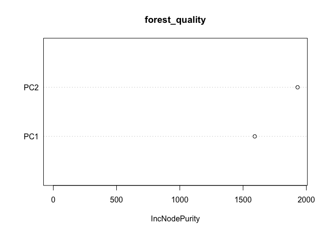
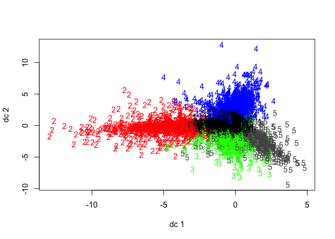
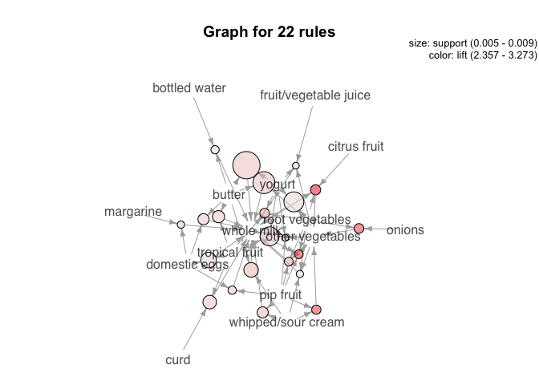
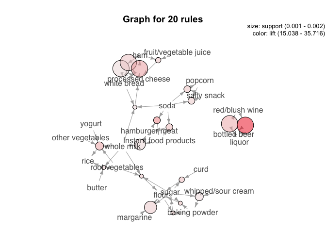

Clustering and PCA: Wine Color and Quality
------------------------------------------

The wine dataset details wine color, quality, and 11 chemical
attributes. Using these variables, I performed principle component
analysis, compressing all the variables down into 5 principle
components. Once I examined these components, I found that only 1
component (PC1) was very powerful in its correlation with color, and no
principle component consistently is correlated with quality, so I
reduced the PCA to just 2 components. Below is a plot of the two
principle components, with the color of each data point denoting the
color of the wine in the first graph (red = 1, white = 0), and color
denoting wine quality in the second.

    ## Importance of first k=2 (out of 11) components:
    ##                           PC1    PC2
    ## Standard deviation     1.7407 1.5792
    ## Proportion of Variance 0.2754 0.2267
    ## Cumulative Proportion  0.2754 0.5021

Clearly, component 1 is highly correlated with the wine color. Neither
component is correlated with quality. I then combine the PC1 and PC2
variables with the dataset for each wine, and build a random forest
model of wine color regressed on these components on a training set. The
resulting RMSE from testing the model on a test set against actual wine
color is below (~0.1). Additionally, the variable importance plot below
confirms that PC1 is most significant in predicting wine color.

    ## [1] 0.1244108

I then tested out the predictive power of this random forest model for
predicting wine quality. The RMSE and variable importance plot is below.
PC2 is most important in predicting wine quality, but PC1 is also
significant.

    ## [1] 0.7550723

### Clustering for Wine Color and Quality

I also ran k-means clustering to predict wine color by removing the
color and quality variables, and splitting the data into 2 clusters
based on the other 11 chemical elements. To see how effectively the
clusters captured color, I attached the cluster assignment to the data
and observed that cluster 1 captures mostly red wines, and cluster 2
captures mostly white wines. I then looked at the RMSE to see how well
the clusters align with the actual wine color. The kmeans-method
captured wine color effectively with an RMSE of ~0.11.

    ## [1] 0.1189974

### Conclusion

I recommend using the PCA method of predicting wine color. Kmeans
clustering also does a decnt job of predicting wine color, just is not
quite as effective as PCA. I found that there is no reliable way to
predict the wine quality score, which is understandable as quality is
objective and dictated by a diverse group of people and palates.

Market Segmentation: Twitter Marketing
--------------------------------------

HOW CHOOSE \# OF CLUSTERS

In order to streamline and sharpen the marketing efforts of NutrientH2O,
we have assembled a dataset of tweet categorizations for the brand’s
followers. After analyzing this data, we have a few insights that may
lead to more focused, productive marketing.

    ## [1] 5179  815  641  752  495

After some experimentation, I used kmeans++ to sort the tweet data into
clusters. After experimenting with various numbers of clusters, I chose
to separate the data into 5 clusters. These clusters are different
sizes, but capture very specific interest groups. One cluster is by far
the largest, and the other 4 are smaller in comparison, but capture more
specific interests. The five clusters can be summarized by their key
topics below.

#### Cluster topics:

##### Cluster A, “say it with a tweet”: Current Events, Personal Fitness, Shopping

##### Cluster B, “college kids”: College, Online Gaming

##### Cluster C, “pinterest crowd”: Cooking, Fashion, Beauty

##### Cluster D, “southern parents”: Sports, religion, food, parenting

##### Cluster E, “business crowd”: politics, travel, news

I have created a nickname for each cluster based on the topics. The
largest cluster, Cluster A (5207 users), is most likely the cluster of
people who tweet about anything and everything. This cluster may be
difficult to hone in on as it is more difficult to target specifically.
However, the other 4 clusters are very specific and easily targetable.

The “college kids” (455 users) cluster tweets about gaming and their
colleges, as well as about sports. Targeting this crowd with
University-specific campaigns may be effective.

The “pinterest crowd” cluster (639 users) tweets often about cooking,
fashion and beauty. These three topics usually draw in a crowd that
would be a heavy user of the platform Pinterest which enables users to
easily find recipes, clothes, and cooking techniques, among other
things. This segment could be targeted through partnering with specific
brands or going the “influencer” route and paying for instagram
influencers to promote product.

The “southern parents” (830 users) cluster tweets often about sports,
religion, food and parenting. This cluster can be targeted through ads
during sporting events or by appealing to the benefits of the product
for children or for energy needed when raising children.

The final cluster is the “business crowd” (751 users) who tweet about
politics, travel and news. This segment can be targeted through
newspapers, travel lounges, or other news outlets.

Each cluster can be grown by using a targeted, thoughtful approach to
marketing.

Association Rules for Grocery Purchases
---------------------------------------

Using data from ~9800 grocery baskets, I have created a set of rules
that reflect buying behavior. After playing with the support and
confidence levels, I chose to create rules based on a support level of
&gt; 0.0025, confidence of over 0.5, and with a maximum cart size of 8
items. This specification created 645 ‘rules’. After a lot of playing
around with the confidence and support levels, I chose these levels to
see a variety of relatively likely combinations, to then trim down into
more likely rules. The support level indicates the proportion of times
any combination of items occurred in the dataset. A support level of at
least 0.0025 means that at the bare minimum, any rule must have occurred
in the cart 25 times. The confidence level captures the probability the
right hand side groceries are in the cart, given the left hand side
groceries are in the cart. I felt a 50% confidence was a sufficient
floor to work from. Finally, I made the minimum length 1 item in order
to capture in highly likely, single item purchases.

After creating this set of rules, I trimmed the rules down to only
include rules with confidence over 50%. Below is the plot of the full
set of 171 rules. The lift range on the graph details the increase in
probability that the right hand side occurs, given the left hand side
occurs.

    ## Apriori
    ## 
    ## Parameter specification:
    ##  confidence minval smax arem  aval originalSupport maxtime support minlen
    ##        0.25    0.1    1 none FALSE            TRUE       5  0.0025      1
    ##  maxlen target  ext
    ##      10  rules TRUE
    ## 
    ## Algorithmic control:
    ##  filter tree heap memopt load sort verbose
    ##     0.1 TRUE TRUE  FALSE TRUE    2    TRUE
    ## 
    ## Absolute minimum support count: 24 
    ## 
    ## set item appearances ...[0 item(s)] done [0.00s].
    ## set transactions ...[169 item(s), 9835 transaction(s)] done [0.00s].
    ## sorting and recoding items ... [142 item(s)] done [0.00s].
    ## creating transaction tree ... done [0.00s].
    ## checking subsets of size 1 2 3 4 5 done [0.01s].
    ## writing ... [2570 rule(s)] done [0.00s].
    ## creating S4 object  ... done [0.00s].

    ## To reduce overplotting, jitter is added! Use jitter = 0 to prevent jitter.

Using the trimmed subset with confidence &gt; 0.6 and support &gt; 0.005
yields the 22 rules below. Notice that the lift for these rules ranges
from ~2-3. These rules reflect the frequency with which customers
purchase whole milk and vegetables. It seems that these two items are
the only ones that can be predicted with high confidence and support,
likely due the frequency with which they are purchased.

    ##      lhs                        rhs                    support confidence    coverage     lift count
    ## [1]  {onions,                                                                                       
    ##       root vegetables}       => {other vegetables} 0.005693950  0.6021505 0.009456024 3.112008    56
    ## [2]  {curd,                                                                                         
    ##       tropical fruit}        => {whole milk}       0.006507372  0.6336634 0.010269446 2.479936    64
    ## [3]  {domestic eggs,                                                                                
    ##       margarine}             => {whole milk}       0.005185562  0.6219512 0.008337570 2.434099    51
    ## [4]  {butter,                                                                                       
    ##       domestic eggs}         => {whole milk}       0.005998983  0.6210526 0.009659380 2.430582    59
    ## [5]  {butter,                                                                                       
    ##       whipped/sour cream}    => {whole milk}       0.006710727  0.6600000 0.010167768 2.583008    66
    ## [6]  {bottled water,                                                                                
    ##       butter}                => {whole milk}       0.005388917  0.6022727 0.008947636 2.357084    53
    ## [7]  {butter,                                                                                       
    ##       tropical fruit}        => {whole milk}       0.006202339  0.6224490 0.009964413 2.436047    61
    ## [8]  {butter,                                                                                       
    ##       root vegetables}       => {whole milk}       0.008235892  0.6377953 0.012913066 2.496107    81
    ## [9]  {butter,                                                                                       
    ##       yogurt}                => {whole milk}       0.009354347  0.6388889 0.014641586 2.500387    92
    ## [10] {domestic eggs,                                                                                
    ##       pip fruit}             => {whole milk}       0.005388917  0.6235294 0.008642603 2.440275    53
    ## [11] {domestic eggs,                                                                                
    ##       tropical fruit}        => {whole milk}       0.006914082  0.6071429 0.011387900 2.376144    68
    ## [12] {pip fruit,                                                                                    
    ##       whipped/sour cream}    => {other vegetables} 0.005592272  0.6043956 0.009252669 3.123610    55
    ## [13] {pip fruit,                                                                                    
    ##       whipped/sour cream}    => {whole milk}       0.005998983  0.6483516 0.009252669 2.537421    59
    ## [14] {fruit/vegetable juice,                                                                        
    ##       other vegetables,                                                                             
    ##       yogurt}                => {whole milk}       0.005083884  0.6172840 0.008235892 2.415833    50
    ## [15] {other vegetables,                                                                             
    ##       root vegetables,                                                                              
    ##       whipped/sour cream}    => {whole milk}       0.005185562  0.6071429 0.008540925 2.376144    51
    ## [16] {other vegetables,                                                                             
    ##       pip fruit,                                                                                    
    ##       root vegetables}       => {whole milk}       0.005490595  0.6750000 0.008134215 2.641713    54
    ## [17] {pip fruit,                                                                                    
    ##       root vegetables,                                                                              
    ##       whole milk}            => {other vegetables} 0.005490595  0.6136364 0.008947636 3.171368    54
    ## [18] {other vegetables,                                                                             
    ##       pip fruit,                                                                                    
    ##       yogurt}                => {whole milk}       0.005083884  0.6250000 0.008134215 2.446031    50
    ## [19] {citrus fruit,                                                                                 
    ##       root vegetables,                                                                              
    ##       whole milk}            => {other vegetables} 0.005795628  0.6333333 0.009150991 3.273165    57
    ## [20] {root vegetables,                                                                              
    ##       tropical fruit,                                                                               
    ##       yogurt}                => {whole milk}       0.005693950  0.7000000 0.008134215 2.739554    56
    ## [21] {other vegetables,                                                                             
    ##       tropical fruit,                                                                               
    ##       yogurt}                => {whole milk}       0.007625826  0.6198347 0.012302999 2.425816    75
    ## [22] {other vegetables,                                                                             
    ##       root vegetables,                                                                              
    ##       yogurt}                => {whole milk}       0.007829181  0.6062992 0.012913066 2.372842    77

If we loosen the rules and only require that the lift be greater than
15, we find these rules below. Sorting rules based on lift instead of
confidence demonstrates clusters of items that are frequently bought
together, even if they do not occur enough to result in high confidence
or support. The clusters below can be loosely interpreted as an alcohol
cluster, a snack cluster, a baking cluster, a sandwich cluster, and
other non-specific clusters.

    ## Apriori
    ## 
    ## Parameter specification:
    ##  confidence minval smax arem  aval originalSupport maxtime support minlen
    ##         0.1    0.1    1 none FALSE            TRUE       5   0.001      1
    ##  maxlen target  ext
    ##       8  rules TRUE
    ## 
    ## Algorithmic control:
    ##  filter tree heap memopt load sort verbose
    ##     0.1 TRUE TRUE  FALSE TRUE    2    TRUE
    ## 
    ## Absolute minimum support count: 9 
    ## 
    ## set item appearances ...[0 item(s)] done [0.00s].
    ## set transactions ...[169 item(s), 9835 transaction(s)] done [0.00s].
    ## sorting and recoding items ... [157 item(s)] done [0.00s].
    ## creating transaction tree ... done [0.00s].
    ## checking subsets of size 1 2 3 4 5 6 done [0.01s].
    ## writing ... [32791 rule(s)] done [0.00s].
    ## creating S4 object  ... done [0.01s].

    ##      lhs                        rhs                         support confidence    coverage     lift count
    ## [1]  {bottled beer,                                                                                      
    ##       liquor}                => {red/blush wine}        0.001931876  0.4130435 0.004677173 21.49356    19
    ## [2]  {bottled beer,                                                                                      
    ##       red/blush wine}        => {liquor}                0.001931876  0.3958333 0.004880529 35.71579    19
    ## [3]  {popcorn,                                                                                           
    ##       soda}                  => {salty snack}           0.001220132  0.6315789 0.001931876 16.69779    12
    ## [4]  {salty snack,                                                                                       
    ##       soda}                  => {popcorn}               0.001220132  0.1304348 0.009354347 18.06797    12
    ## [5]  {Instant food products,                                                                             
    ##       soda}                  => {hamburger meat}        0.001220132  0.6315789 0.001931876 18.99565    12
    ## [6]  {hamburger meat,                                                                                    
    ##       soda}                  => {Instant food products} 0.001220132  0.2105263 0.005795628 26.20919    12
    ## [7]  {Instant food products,                                                                             
    ##       whole milk}            => {hamburger meat}        0.001525165  0.5000000 0.003050330 15.03823    15
    ## [8]  {ham,                                                                                               
    ##       processed cheese}      => {white bread}           0.001931876  0.6333333 0.003050330 15.04549    19
    ## [9]  {processed cheese,                                                                                  
    ##       white bread}           => {ham}                   0.001931876  0.4634146 0.004168785 17.80345    19
    ## [10] {ham,                                                                                               
    ##       white bread}           => {processed cheese}      0.001931876  0.3800000 0.005083884 22.92822    19
    ## [11] {fruit/vegetable juice,                                                                             
    ##       ham}                   => {processed cheese}      0.001118454  0.2894737 0.003863752 17.46610    11
    ## [12] {baking powder,                                                                                     
    ##       flour}                 => {sugar}                 0.001016777  0.5555556 0.001830198 16.40807    10
    ## [13] {baking powder,                                                                                     
    ##       sugar}                 => {flour}                 0.001016777  0.3125000 0.003253686 17.97332    10
    ## [14] {sugar,                                                                                             
    ##       whipped/sour cream}    => {baking powder}         0.001321810  0.2708333 0.004880529 15.30831    13
    ## [15] {curd,                                                                                              
    ##       sugar}                 => {flour}                 0.001118454  0.3235294 0.003457041 18.60767    11
    ## [16] {margarine,                                                                                         
    ##       sugar}                 => {flour}                 0.001626843  0.2962963 0.005490595 17.04137    16
    ## [17] {butter,                                                                                            
    ##       root vegetables,                                                                                   
    ##       whole milk}            => {rice}                  0.001016777  0.1234568 0.008235892 16.18930    10
    ## [18] {soda,                                                                                              
    ##       white bread,                                                                                       
    ##       whole milk}            => {processed cheese}      0.001016777  0.2500000 0.004067107 15.08436    10
    ## [19] {root vegetables,                                                                                   
    ##       sugar,                                                                                             
    ##       whole milk}            => {flour}                 0.001016777  0.2941176 0.003457041 16.91606    10
    ## [20] {other vegetables,                                                                                  
    ##       root vegetables,                                                                                   
    ##       whole milk,                                                                                        
    ##       yogurt}                => {rice}                  0.001321810  0.1688312 0.007829181 22.13939    13

Author Attribution
------------------

Fo rthis problem, I used text from 50 authors with 50 articles each to
predict authorship based on words used. In order to do this, I first
read and cleaned all of the file names from the directory source. I then
read in the text from every article and stored in in a large corpus. In
order to standardize the text, I removed punctuation, capitalization and
whitespace, as well as common words using the “SMART” dictionary.

Once all of the training and testing data was processed, I created a
Document Term Matrix (DTM) for both the testing and training sets.

    ## <<DocumentTermMatrix (documents: 2500, terms: 848)>>
    ## Non-/sparse entries: 204235/1915765
    ## Sparsity           : 90%
    ## Maximal term length: 18
    ## Weighting          : term frequency (tf)

The training DTM details are above. I have trimmed the words that are
only included a few times in order to eliminate noise. We are left with
~850 words, down from ~31,000. I repeat the same process of creating the
DTM for the test set of data, except instead of trimming sparse words, I
go ahead and set the limitation that all words in the test DTM must also
be in the training DTM.

    ## <<DocumentTermMatrix (documents: 2500, terms: 848)>>
    ## Non-/sparse entries: 204756/1915244
    ## Sparsity           : 90%
    ## Maximal term length: 18
    ## Weighting          : term frequency (tf)

Above are the details for the testing set which matches the training
set.

Next, I remove any columns in the testing or training sets that contain
no values (no words in articles), and I confirm that all columns match
between testing and training.

### PCA

In order to try prediction models, I first use PCA to create principle
components to use as variables in prediction. I create principle
components using the training data, and then predict the PCA values onto
the testing data. I then look at the cumulative variance explained
versus the number of principle components in order to choose a number of
principle components that explains about 75% of the variance. This
occurs at PC263, so I will move forward using the first 263 principle
components. The chart below shows the sumulative sum of the variance
versus the number of principle components.

Once I summarized my training data using principle component analysis, I
created a new training dataset with only the principle components, and
author names. I also created a testing dataset with the scaled predicted
principle components, and author names. I then ran a random forest model
to predict author using the principle components in the training set.
Using this model, I predicted the outcomes on the testing set, and
looked at the ‘hitrate’ (percent correct predictions).

    ## [1] 1288

    ## [1] 51.52

The two numbers above reflect the number of correct predictions out of
2500, and the percentage correct. This model runs at about 50% accuracy.

### KNN Prediction

Next, I will look at using a KNN model to see if I can improve the
accuracy. The KNN model will predict the author on the testing set using
nearest neighbors prediction using k=5.

    ## 
    ## Attaching package: 'class'

    ## The following object is masked from 'package:igraph':
    ## 
    ##     knn

    ## [1] 628

    ## [1] 25.12

As shown above, the KNN model works about half as well as the random
forest. I will opt to use the Random Forest model.

### Conclusion

In general, I would have hoped for higher accuracy using one of these
models. However, the random forest model performed fairly well.
