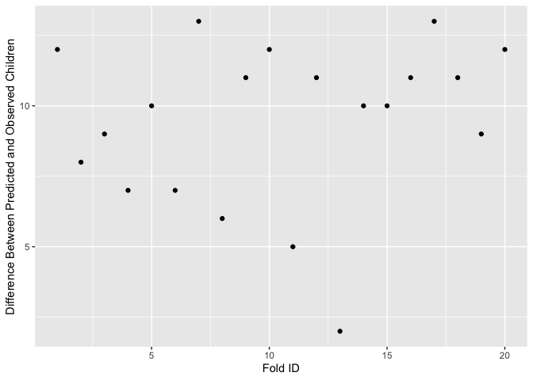

Problem 1
---------

### Part 1

The plot above shows average number of riders per hour by day and by
month (line color).

As shown in the plot above, on weekdays, no matter which month,
ridership generally peaks between 3 and 4pm. The month of September sees
fewer average riders on Mondays, likely due to Labor Day weekend
weighting down the average as students leave campus. November sees fewer
average riders on Wednesday , Thursday and Friday, likely due to
Thanksgiving Holidays weighing down the mean as students leave campus.
On weekends, there are much fewer riders on average, though it seems
Saturday sees a steady stream between 10am and 8pm, while on Sundays,
ridership doesnt pick up until midday, but also drops off around 8pm.

### Part Two

Plot showing ridership versus temperature by hour of the day

When holding hour of day and weekend status constant, temperature seems
to have little effect on ridership. If temperature had an effect, we
would see dots of the same color creeping up in riders as temperature
increases. However, for both within weekends and within weekdays,
ridership seems relatively uniformly distributed across temperatures.

Problem 2
---------

The KNN model and the hand-built model achieved similar out-of-sample
mean-squared error, and both beat the medium model. I built two models–
one linear model and one using the K-Nearest-Neighbors technique. The
hand-built model took into account a variety of home attributes
including bedrooms, bathrooms, rooms, living space, lot size, land
value, age, location (waterfront), and various interactions of these
variables. This process was relatively time and data intensive when
trying to choose which variables are significant, and which are not.
Then I used the K-Nearest-Neighbors approach which simply looks at a
given number of homes that are similar in attributes, and predicts a
price for a given house. This technique is less thoughtful, but delivers
results close to, and in some cases exceeding, results from the
hand-built model when considering out of sample mean squared error.

When assessing home value for taxing purposes, I would suggest using the
K-Nearest-Neighbors approach to achieve results comparable to a more
human-built model, in much less time. This approach will also succeed in
the long term in understanding how different home attributes change in
value to buyers. As tastes change, the model will simply capture these
changing tastes by relating attributes to home value, rather than
require any sort of all-knowing model builder to properly account for
these changes.

The mean RMSE values below justify the choice of the KNN model for
predicting house value.

    ## [1] 0.6834982

The mean RMSE above is for the medium model.

    ## [1] 0.6085439

Above is the mean RMSE for the linear model.

    ## Warning: executing %dopar% sequentially: no parallel backend registered

    ## [1] 0.5967797

Above is the minimum mean RMSE for the KNN model.

Problem 3
---------

The chart above shows the probability that a lender defaults on their
loan based on their Credit History. Contrary to what one might assume,
the graph suggests that borrowers with good credit are more likely to
default on a loan.

Logit model accuracy:

    ##    yhat
    ## y     0   1
    ##   0 130   8
    ##   1  46  15

    ## [1] 0.7286432

The logit model predicts whether a borrower will default on their loan
based on the loan duration, amount, installments, age of borrower,
credit history, purpose and foreign status. As shown by the confusion
matrix output and the accuracy score, this model is only successful
about 72% of the time.

As discussed above, a borrower’s good credit history actually is
correlated with a higher probability of default. This could be showing
up because of how loan decisions are made. If mostly borrowers with high
credit are awarded loans, then they will represent a higher proportion
of the loan data and of the default data. It is also possible that good
credit holders are over-leveraged due to their good credit, and
therefore more likely to default on a loan due to overall credit
holdings. It seems there is some selection bias towards good credit in
the loan awards in general, and this data suggests perhaps good credit
is not alone a good predictor of credit-worthiness.

Based on the chart above and the model accuracy, this model is a poor
choice for predicting high vs low probability of default. This model
does not do a great job of predicting defaults. The data has
over-sampled defaults and has not accounted for the selection bias
associated with good credit. This dataset and predictive model would
under-predict credit default for bad credit score borrowers and
over-predict for high credit score borrowers. The new sample of data
will need to have extensive data on the ‘poor’ and ‘terrible’ credit
score borrowers.

Problem 4
---------

#### Baseline 1

This first baseline model model is a logit model, regressed on market
segment, adults, customer type, and repeated guest status. The out of
sample accuracy is below.

    ##    yhat
    ## y      0
    ##   0 8258
    ##   1  741

    ## [1] 0.9176575

This model has an accuracy of ~92.3% based on a probability threshold of
0.5. Children rarely are on bookins, so this simple model never predicts
a child showing up. This model’s accuracy reflects the percent of time
when no children are present.

#### Baseline 2

The next model, baseline 2, predicts children based on all other
variables except arrival date, also using a logistic regression. The out
of sample accuracy is below:

    ##    yhat
    ## y      0    1
    ##   0 8156  102
    ##   1  463  278

    ## [1] 0.9372152

The confusion matrix and accuracy rate above show a slightly more
sophisticated model, boasting slightly better accuracy. The addition of
more covariates improved the model by about 1%.

#### Baseline 3

For the third baseline model, I use the lasso method to arrive at which
variables to use in a predictive model, then plugged them in to a
logistic model.

    ##    yhat
    ## y      0    1
    ##   0 8158  100
    ##   1  466  275

    ## [1] 0.9371041

This model performs the best of the three, with out of sample accuracy
of ~94%. The Lasso resulted in the choice variables: hotel, lead\_time,
adults, meal, market\_segment, distribution\_channel,
is\_repeated\_guest, previous\_bookings\_not\_canceled,
reserved\_room\_type, booking\_changes, customer\_type,
average\_daily\_rate, total\_of\_special\_requests, and arrival\_date. I
will move forward with this model to the validation data.

### Validation Step 1

Using the model identified in the previous section, I predicted outcomes
of the full validation data set, then looked at the True Positive vs
False Positive rates by threshold, as shown in the graph below.

The ROC curve above charts the false positive rate versus the true
positive rate for the Lasso model built in the last section.

### Validation Step 2

For the final validation step, I used the validation data to fit my best
performing model. I then assigned a prediction to each observation
before splitting the data into 20 randomly assigned groups. Within each
group I calculated the predicted and actual probability of a child, as
well as the predicted and actual number of children who did arrive. I
took the difference between reality and prediction and charted it below.

The chart above shows the difference between prediction and reality for
each fold. The difference varies greatly from fold to fold, suggesting
that even our best model cannot consistently predict whether a child
will be present on a booking across random groups of observations.
